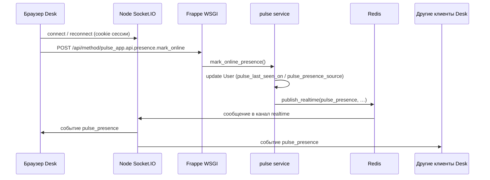
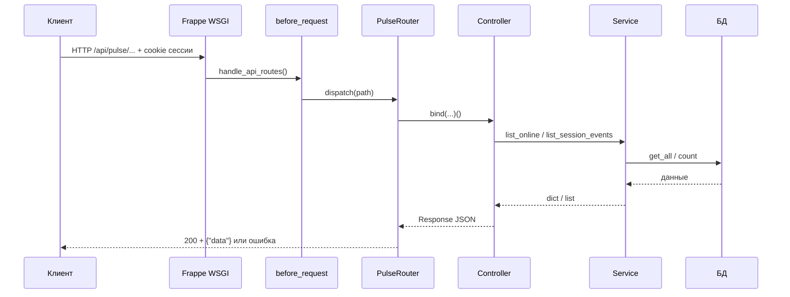

# Pulse — архитектура и функционал

Документ описывает **назначение** приложения **pulse_app**, **полный функционал** (реализованный и запланированный), **архитектуру** кода и данных, **API**, **безопасность** и интеграцию с **сессией Frappe** и **WebSocket/Socket.IO**.

---

## 1. Назначение

**Pulse** — Frappe-приложение для:

- учёта **последней активности** пользователя («last seen»);
- отображения списка пользователей **онлайн** по активным подключениям Socket.IO (Redis-счётчики);
- **рассылки обновлений присутствия в реальном времени** через **`frappe.publish_realtime`** (штатный Redis → Node Socket.IO → клиенты Desk);
- хранения **истории событий входа и выхода** (Login / Logout) с метаданными запроса.

Приложение **не заменяет** ядро **User**: присутствие хранится только в **Custom Fields** у **User**; журнал входов/выходов — в **Pulse Session Event**. Отдельного DocType «профиль» нет.

---

## 2. Полный функционал

### 2.1. Матрица: реализовано / в планах

| Возможность | Статус | Примечание |
|-------------|--------|------------|
| Обновление присутствия при **подключении / переподключении Socket.IO Desk** | Реализовано | `public/js/pulse_socket.js` → **`mark_online`** при **`connect` / `reconnect`** (обновление БД). Периодического HTTP heartbeat **нет**. |
| Рассылка изменений всем подключённым клиентам Desk | Реализовано | Python: **`frappe.publish_realtime("pulse_presence", …)`**; Node **`pulse_app/realtime/handlers.js`** публикует в тот же Redis-канал **`events`**. Клиент: **`frappe.realtime.on("pulse_presence", …)`**. |
| Снимок «онлайн» по REST (`GET .../presence/online`) | Реализовано | Только счётчики Socket.IO в Redis (**`pulse_app:socket_ref:{site}`**). |
| Чтение истории сессий (`GET .../session-events`) | Реализовано | Обычный пользователь — только свои записи; **System Manager** — фильтр `user` и полный журнал. |
| Запись Login/Logout в **Pulse Session Event** | Частично | Есть **`record_session_event()`**; автоматический вызов из хуков авторизации Frappe — по желанию. |
| Отображение DocTypes в Desk | Метаданные | Права см. раздел «Безопасность». |
| Событие **disconnect** сокета → обновление списка онлайн | Реализовано | Node уменьшает счётчик вкладок и шлёт **`pulse_presence`** (`offline`) при последнем отключении пользователя. |
| Явный REST только для Login/Logout-событий | Не реализовано | По необходимости — отдельный whitelist или только хуки. |

### 2.2. Логика «кто онлайн»

- Список строится **только** по hash **`pulse_app:socket_ref:{site}`** (счётчики подключений на стороне Node). Уведомления — публикация в Redis-канал **`events`** (как у **`publish_realtime`**).
- **`User.pulse_last_seen_on`** обновляется при **`mark_online`** (после **`connect` / `reconnect`** и т.д.) и используется для отображения last seen / индикаторов, но **не** для membership в списке онлайн Pulse.
- **Сессия Frappe:** пользователь в whitelist определяется через **`frappe.session.user`** — те же cookie / механизм, что у **`/api/method/...`** и Desk.
- **Realtime:** **Redis `events`** → Node **realtime** → **Socket.IO**; см. [документацию Frappe Realtime](https://docs.frappe.io/framework/user/en/api/realtime).

### 2.3. Связь с полем **User.last_login**

- Frappe по-прежнему обновляет **`User.last_login`** при входе штатным способом.
- Pulse **дублирует «вход»** в журнале только при вызове **`record_session_event("Login")`**; **last seen** обновляется при **подключении сокета Desk**, а не по таймеру.

### 2.4. Функционал вне scope текущей версии

- SSO/OAuth-специфика (достаточно общих хуков Frappe при необходимости).
- Геолокация, аудит всех действий пользователя — только если расширять DocTypes и отдельные интеграции.

---

## 3. Архитектура приложения

Идея слоёв совпадает с подходом **`edoc_app`** (`edoc_frappe_app`): разделение маршрутизации, HTTP-обработчиков, сценарной логики и данных.

### 3.1. Слои

| Слой | Расположение | Ответственность |
|------|----------------|-----------------|
| **HTTP / routing** | `pulse_app/core/router/pulse_router.py`, `pulse_app/http/routes/*.py`, `pulse_app/utils/api_routes.py` | Сопоставление пути и метода обработчику; единый JSON для ошибок; `rollback` для транзакций на `POST`. |
| **Контроллеры** | `pulse_app/pulse/modules/*/controller.py` | Аутентификация на уровне запроса, разбор query string, вызов сервиса, формирование ответа. |
| **Сервисы** | `pulse_app/pulse/modules/*/service.py` | Бизнес-сценарии: работа с DocType, порог онлайн, пагинация. |
| **Данные** | `pulse_app/pulse/doctype/*` | Метаданные DocType, классы `Document`. |

Дополнительно: **`pulse_app/bin/serializers/http_response.py`** — успешные ответы `{"data": ...}`, списки `{"data": [...], "total": N}`, ошибки `{"error": {"code", "message"}}`, опционально `debug` при `pulse_api_debug`.

### 3.2. Структура репозитория

```
frappe_pulse/
├── docs/
│   └── ARCHITECTURE.md
├── README.md
├── pyproject.toml
└── pulse_app/
    ├── hooks.py
    ├── modules.txt                 # модуль Desk: Pulse
    ├── patches.txt
    ├── core/router/                # PulseRouter (Werkzeug Map)
    ├── http/
    │   ├── request_helpers.py
    │   └── routes/                 # регистрация @router.route
    ├── bin/serializers/
    ├── utils/api_routes.py         # before_request → префикс /api/pulse/*
    ├── api/presence.py             # whitelist mark_online (realtime-драйвер)
    ├── public/js/pulse_socket.js   # connect/reconnect → mark_online; on pulse_presence
    └── pulse/
        ├── install.py              # after_install / after_migrate
        ├── modules/user_presence/
        │   ├── controller.py
        │   └── service.py
        └── doctype/
            └── pulse_session_event/
```

### 3.3. Поток присутствия (Socket.IO + whitelist + realtime)



### 3.4. Поток запроса REST (`/api/pulse/*`)

Только **`GET .../presence/online`** и **`GET .../session-events`** — через **`PulseRouter`** (как раньше).



1. В **`hooks.py`** зарегистрирован **`before_request`**: `pulse_app.utils.api_routes.handle_api_routes`.
2. Если путь начинается с **`/api/pulse`**, вызывается **`PulseRouter.dispatch`** (после **`router.build()`**).
3. Обработчик — **`bind(ControllerClass, "method")`**.
4. Исключения Frappe маппятся в JSON внутри **`PulseRouter.dispatch`**.
5. **`app_include_js`** подключает **`pulse_socket.js`** на Desk.

### 3.5. Сессия Frappe и идентификация пользователя

- **`mark_online`** (whitelist) и REST **`/api/pulse/*`** рассчитывают на сессию пользователя не **`Guest`**.
- Отдельного токена Pulse нет: используются **штатная сессия сайта** и подключение Socket.IO с теми же учётными данными, что проверяет realtime-сервер Frappe.

---

## 4. Модель данных (DocTypes)

### 4.1. Расширение User (Custom Field)

| Поле | Тип | Описание |
|------|-----|----------|
| `pulse_last_seen_on` | Datetime | Последнее успешное **`mark_online`** (обычно после **connect/reconnect** Socket.IO). Список User: индикатор Online/Away. |
| `pulse_presence_source` | Data | Необязательная метка клиента из **`service`** (desk, portal-spa, …). |

### 4.2. Pulse Session Event (история)

| Поле | Тип | Описание |
|------|-----|----------|
| `user` | Link → User | Пользователь. |
| `event_type` | Select | `Login` или `Logout`. |
| `occurred_on` | Datetime | Момент события. |
| `ip_address` | Data | IP клиента (с учётом `X-Forwarded-For`, см. сервис). |
| `user_agent` | Small Text | Заголовок User-Agent. |

Нумерация: naming series **`PSE-.#####`**.

При миграции со старых версий pulse_app данные из удалённого DocType **Pulse User Profile** при наличии таблицы **один раз** переносятся в поля **User**, затем DocType удаляется из БД.

---

## 5. API: whitelist и REST

### 5.1. Whitelist: `pulse_app.api.presence.mark_online`

- **Назначение:** записать присутствие текущего пользователя и инициировать **`frappe.publish_realtime("pulse_presence", …)`** после коммита транзакции.
- **Вызов:** обычно **`frappe.call`** из **`pulse_socket.js`** при **`connect`** и **`reconnect`** Socket.IO (не по интервалу таймера).
- **Ответ** (`r.message`): `{ "profile": { "user", "last_seen_on", "name" }, "updated_at": … }`.
- **Транспорт до Python:** HTTP **`POST /api/method/pulse_app.api.presence.mark_online`** — это один запрос на событие сокета; **рассылка** другим клиентам идёт уже через **Socket.IO** после Redis.

### 5.2. Клиентский realtime: событие `pulse_presence`

Подписка в **`pulse_socket.js`:**

```javascript
frappe.realtime.on("pulse_presence", function (data) {
  // data.kind, data.user, data.service, data.rev
  $(document).trigger("pulse_presence", data);
});
```

Полезная нагрузка **`pulse_presence`**: **`kind`**, **`user`**, **`service`**, **`rev`** (монотонный счётчик в кэше сайта). Полные данные для страницы «Pulse — онлайн» — только через **`pulse_online_dashboard`** (роли `pulse_online_dashboard_roles`).

### 5.3. REST: базовый префикс **`/api/pulse`**

Формат успеха: **`{"data": ...}`**; список с метаданными: **`{"data": [...], "total": N}`**. Ошибки PulseRouter: **`{"error": {"code", "message"}}`**. Заголовок ответа может содержать **`X-Request-Id`**.

### 5.4. `POST /api/pulse/presence/mark-online` и `POST .../mark-offline`

- Назначение: то же, что whitelist-методы, но через **PulseRouter** и JSON ответа **`{"data": ...}`** — удобно внешним SPA «чисто по REST».
- **`mark-online`**, тело: `{ "service": "portal-spa" }` — необязательное поле **service** (латиница/цифры/`._:-/`, до 120 символов); сохраняется в **`User.pulse_presence_source`** и уходит в **`pulse_presence`** для всех клиентов.
- Подробности и Socket.IO для стороннего фронта: [EXTERNAL_CLIENT.md](EXTERNAL_CLIENT.md).

### 5.5. `GET /api/pulse/presence/online`

- **Назначение:** снимок пользователей онлайн (для первого рендера или интеграций без подписки на realtime).
- **Ответ `data`:** массив `{ "user", "last_seen_on", "service" }`.

### 5.6. `GET /api/pulse/session-events`

- **Назначение:** журнал **Pulse Session Event** с пагинацией.

**Query-параметры:**

| Параметр | По умолчанию | Описание |
|----------|----------------|----------|
| `limit_start` | `0` | Смещение. |
| `limit_page_length` | `50` | Размер страницы. |
| `user` | — | Фильтр по пользователю; **только для System Manager** (иначе 403, если указан чужой user). |

**Правила доступа:**

- Пользователь **без** роли System Manager: всегда видит только **свои** события (фильтр принудительно по текущему пользователю).
- **System Manager:** без `user` — все события; с `user` — только по указанному пользователю.

**Ответ:** `{"data": [ {...}, ... ], "total": N }`, элементы содержат `id`, `user`, `event_type`, `occurred_on` (ISO), `ip_address`, `user_agent`.

---

## 6. Безопасность и права DocType

- В JSON DocTypes для Desk выставлены права в первую очередь для **System Manager**; массовое чтение журналов посторонними ролями через стандартный список Frappe ограничено дизайном прав (проверьте актуальные JSON при доработках).
- REST для истории дополнительно ограничен в **контроллере** (не админ не видит чужие записи через API).
- Запись событий сессии из сервиса выполняется с **`ignore_permissions=True`** там, где сценарий уже проверен логикой приложения; **`mark_online`** обновляет строку **своего** User через **`frappe.db.set_value`** (внутреннее обновление полей).

---

## 7. WebSocket / Socket.IO

- **Доставка `pulse_presence`** — канал Redis **`events`** → процесс **Node realtime**: и **`frappe.publish_realtime`**, и **`pulse_app/realtime/handlers.js`**.
- **Запись last seen в БД** — **`mark_online`** при **`connect` / `reconnect`** (и навигации Desk), без интервального heartbeat.
- **`pulse_app/realtime/handlers.js`** — расширение по [документации Frappe](https://docs.frappe.io/framework/user/en/api/realtime#custom-event-handlers): учёт подключений и **`publish("events", …)`** с телом как у Python.

Подключение **`record_session_event`** к **LoginManager** / **`auth_hooks`** — отдельная задача.

---

## 8. Установка и конфигурация

```bash
bench get-app /path/to/frappe_pulse/pulse_app
bench --site <site> install-app pulse_app
bench migrate
```

- **`pulse_api_debug`** в `site_config.json` / common config: при истине в ответах 500 возможна **`debug`**-информация (трассировка и т.д.) — только для отладки.

---

## 9. Hooks

| Hook | Назначение |
|------|------------|
| `after_install` | `pulse_app.pulse.install.after_install` |
| `after_migrate` | `pulse_app.pulse.install.after_migrate` |
| `before_request` | Префикс **`/api/pulse/*`** → **`PulseRouter`**. |
| `app_include_js` | **`/assets/pulse_app/js/pulse_socket.js`** — привязка к Socket.IO и **`frappe.realtime.on("pulse_presence")`**. |

---

## 10. Связь с примером edoc_app

- Общие идеи: **PulseRouter** по образцу **EdocRouter**, **`bind`**, **`json_response` / `json_error`**, импорт **`http/routes/*.py`** и **`router.build()`**, **`rollback=True`** для изменяющих запросов.
- Специфика EDOC (`page_renderer`, `/edocapp/api`, патчи WSGI) **не** используется; Pulse ограничивается **`before_request`**.

---

## 11. Расширение

- Новые маршруты: файл в **`pulse_app/http/routes/`**, декораторы **`@router.route`**, импорт модуля в **`utils/api_routes.py`** (как в EDOC — иначе правило не зарегистрируется).
- Новая область: каталог **`pulse/modules/<area>/`** с **`controller.py`** и **`service.py`**.

---

*Версия документа соответствует состоянию репозитория **frappe_pulse**; при изменении кода обновляйте §2, §4–§5 и §7.*

---

## 12. Отображение в Desk: список User и форма User

| Что | Как |
|-----|-----|
| **«Онлайн» в списке пользователей** | Custom Field **`pulse_last_seen_on`**. В **`user_pulse.js`**: **`add_fields`** + **`get_indicator`** (Online / Away по **`ONLINE_WINDOW_SEC`**). |
| **Офлайн сразу** | **`pulse_app.api.presence.mark_offline`** очищает last seen и шлёт **`pulse_presence`** с **`kind: offline`**. Вызывается из **`pulse_socket.js`** при **`pagehide`** (закрытие вкладки / уход со страницы) и перед **`frappe.app.logout`**. Остальные клиенты получают событие и **`cur_list.refresh()`** / **`reload_doc`** для открытой формы User — без ожидания истечения окна. |
| **Форма User** | Поле **Pulse last seen**; при realtime-событии по этому пользователю форма перезагружается. |
| **История входов/выходов** | DocType **Pulse Session Event** имеет поле **User** → во вкладке **Connections** у записи User Frappe показывает связанные события (если включены стандартные связи). Отдельный встроенный Child Table в форме User мы не добавляли — можно открыть **Pulse Session Event** и фильтровать по пользователю или использовать отчёт. |

После первого **`migrate`** проверьте, что Custom Field создался (**Customize Form → User** или список Custom Field).

---

## 13. Требования к окружению

- Должны быть запущены **Redis** и процесс **Socket.IO / realtime** (как в стандартной установке `bench`), иначе **`publish_realtime`** не дойдёт до браузеров.
- После изменений в статике приложения: **`bench build`** / сброс кэша при необходимости.
