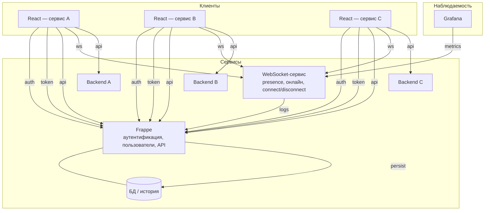
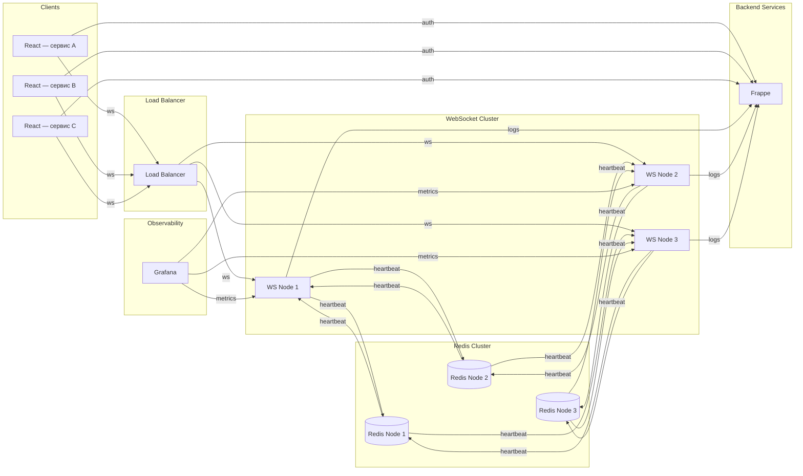
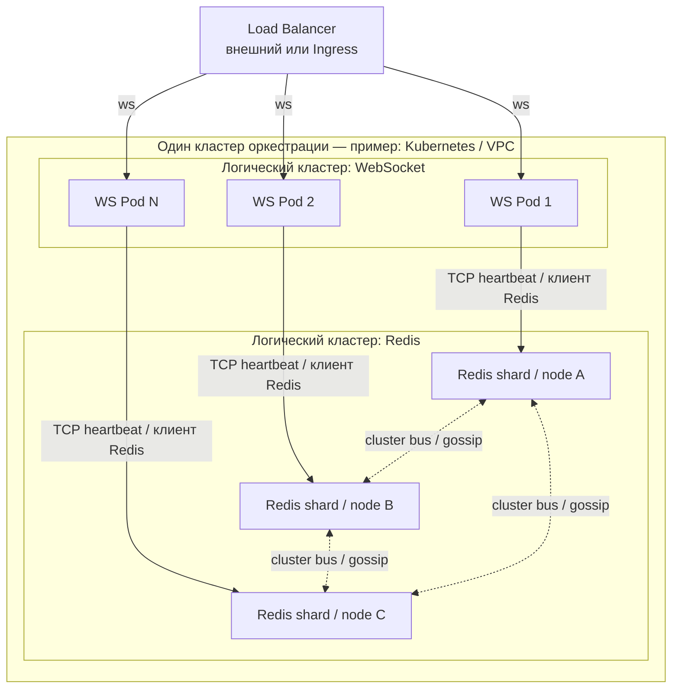
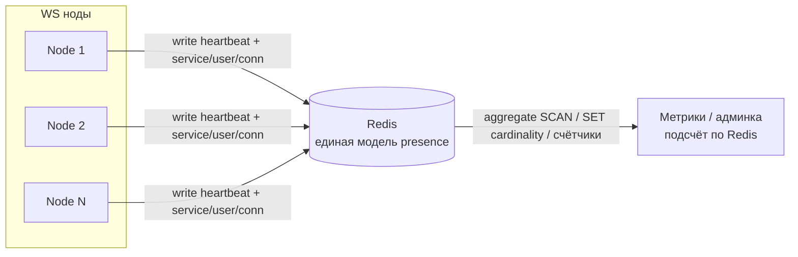
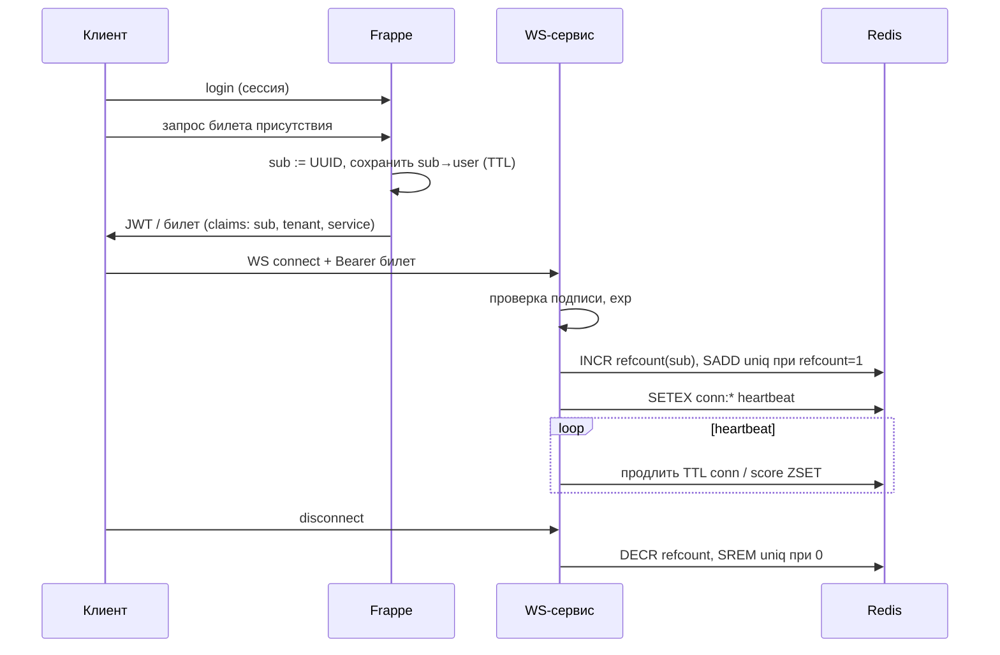

# Архитектура мультисервисной платформы

Документ описывает целевую схему платформы из независимых сервисов с общим центром идентичности и отдельным realtime-слоем. Репозиторий `frappe_pulse` (Pulse) может занимать место одного из сервисов или интегрироваться с ними по тем же принципам.

Два уровня описания:

1. **Общая картина** — все основные участники и потоки (включая backend сервисов A/B/C).
2. **Подробная схема** — масштабируемый слой **presence** на WebSocket: балансировщик, кластер **stateless** WS-нод, **Redis Cluster** как единый источник правды для активных соединений (например ZSET с временными метками и TTL/heartbeat), метрики и логирование в Frappe. Backend сервисов на детальной диаграмме не показаны — они остаются как на общей схеме (`api` к своим backend и к Frappe).

3. **Кластеризация слоёв** — ниже отдельно расписано, как масштабируется **WebSocket-уровень** и **Redis**, и в каком смысле они могут жить в «одном кластере» инфраструктуры, оставаясь **разными логическими кластерами**.

4. **Безопасность** — аутентификация и авторизация API, периметр сети, защита WebSocket, CORS/ошибки, наблюдаемость и чеклист минимума.

5. **Анонимный presence** — WebSocket/realtime-сервис как **чисто информационный** слой: в хранилище и метриках — только **неперсонифицированные** данные; «кто именно онлайн» раскрывается только во **Frappe** при наличии прав.

## Обзор

- Несколько продуктовых сервисов **A, B, C…**, у каждого свой backend и свой React-frontend.
- **Frappe** — центральный сервис: аутентификация, пользователи, API, хранение данных и истории.
- **WebSocket-сервис** — отдельный процесс: присутствие пользователей онлайн, учёт подключений, события connect/disconnect, метрики для наблюдаемости.
- **Grafana** — визуализация метрик, источник которых — WebSocket-сервис.

## Роли компонентов

| Компонент | Роль |
|-----------|------|
| **Frappe** | Login/session, API, идентичность пользователя, пользовательская модель, БД; приём логов входа/выхода из WebSocket-сервиса и сохранение истории. |
| **WebSocket-сервис** | Realtime presence: соединения, счётчик онлайна, события подключения/отключения; экспорт/отдача метрик; отправка сведений о login/logout в Frappe. |
| **Grafana** | Дашборды по метрикам WebSocket-сервиса. |
| **Сервисы A, B, C…** | Собственная бизнес-логика (backend) и UI (React); доверие к Frappe для auth; подключение клиентов к WebSocket-сервису для realtime. |

## Потоки данных

1. React-приложения проходят **аутентификацию** через Frappe.
2. React-приложения получают **токен** (или эквивалент сессии) от Frappe.
3. React-приложения вызывают **API Frappe** там, где нужны центральные данные и права.
4. React-приложения открывают **WebSocket** к отдельному сервису для presence и realtime.
5. React-приложения обращаются к **своему backend** по **API** сервиса.
6. WebSocket-сервис **учитывает** активные соединения и онлайн.
7. WebSocket-сервис **отдаёт метрики**; **Grafana** их **читает** (например scrape или запрос к endpoint — конкретика реализации не зафиксирована в схеме).
8. WebSocket-сервис передаёт в Frappe **логи login/logout** (или агрегаты событий); Frappe **пишет историю** в БД.

## Диаграмма: общая картина

### Условные обозначения на стрелках

- **auth** — вход, проверка учётной записи через Frappe.
- **token** — выдача токена/сессии после успешной аутентификации.
- **api** — HTTP API (к Frappe или к своему backend сервиса).
- **ws** — постоянное соединение к WebSocket-сервису для realtime presence.
- **metrics** — получение Grafana метрик с WebSocket-сервиса.
- **logs** — передача событий login/logout (или связанных записей) в Frappe.
- **persist** — сохранение истории и прочих данных в БД под управлением Frappe.

---

## Подробная схема: presence на WebSocket (масштабирование)

Ниже — уточнение только для realtime-слоя: клиенты по-прежнему проходят **auth** в Frappe, затем открывают **ws** через **Load Balancer** на одну из нод кластера. Ноды **не хранят** состояние presence локально как источник правды: они пишут и читают **heartbeat** (и связанные ключи) в **Redis Cluster**. Агрегация «кто онлайн» строится по данным Redis. Каждая WS-нода отдаёт **metrics** (endpoint для scrape или аналог); **Grafana** опрашивает ноды. События входа/выхода из presence-сессии уходят в Frappe как **logs** для истории в БД.

### Компоненты детальной схемы

| Компонент | Роль |
|-----------|------|
| **Клиенты** | Несколько React-приложений (разные сервисы); после auth к Frappe — WebSocket через балансировщик. |
| **Load Balancer** | Распределение долгоживущих WS-соединений по нодам кластера. |
| **WebSocket Cluster** | Несколько **stateless** процессов: приём/отправка событий, heartbeat в Redis, расчёт онлайна по чтению из Redis, endpoint метрик. |
| **Redis Cluster** | Общее хранилище presence (активные соединения, TTL, heartbeat); один логический источник правды для всех WS-нод. |
| **Frappe** | Аутентификация и идентичность; приём **logs** (login/logout / сессии presence) и запись истории. |
| **Grafana** | Визуализация метрик с WS-нод (в т.ч. агрегаты по онлайну, если экспортируются в метриках). |

### Потоки (детализация)

1. Клиенты → **auth** → Frappe.
2. Клиенты → **ws** → Load Balancer → конкретная WS-нода.
3. WS-ноды → **heartbeat** → Redis (запись слотов присутствия, обновление времени / TTL).
4. Redis хранит активные соединения (модель данных на стороне реализации — например ZSET по времени и политика протухания).
5. WS-ноды → **heartbeat** ← Redis (чтение для вычисления числа онлайн-пользователей и рассылки событий при необходимости).
6. WS-ноды публикуют **metrics**; Grafana забирает **metrics** с нод.
7. WS-ноды → **logs** → Frappe; Frappe сохраняет историю сессий в БД.

### Диаграмма: кластер WS + Redis

### Подписи на стрелках (детальная схема)

| Подпись | Смысл |
|---------|--------|
| **auth** | Проверка пользователя и выдача доверенных данных/токена в Frappe до установки WS. |
| **ws** | Долгоживущее WebSocket-соединение клиента (через балансировщик к ноде). |
| **heartbeat** | Запись и чтение состояния presence и служебных ключей в Redis (в т.ч. для TTL и онлайна). |
| **metrics** | Запрос метрик с WS-нод (например Prometheus scrape → Grafana). |
| **logs** | События login/logout (или эквивалент) из WS-слоя в Frappe для истории. |

---

## Один кластер или два: как не перепутать смысл слова «кластер»

**Логически это два разных кластера**, потому что это две разные подсистемы с разным масштабированием и отказами:

| | **Кластер WebSocket** | **Кластер Redis** |
|---|------------------------|-------------------|
| Что масштабируется | Процессы приложения (CPU, число одновременных соединений, event loop) | Память под ключи, пропускная способность записи/чтения, шардирование |
| Роль | Держит **открытые сокеты** у клиентов | Хранит **модель presence** (ключи, ZSET, TTL), общую для всех WS-нод |
| Отказ ноды | Соединения на этой ноде рвутся → клиент переподключается на другую (при живом LB) | Нужна политика failover / выборов мастера (зависит от топологии Redis) |

**Инфраструктурно они часто живут в одном «кластере оркестрации»** — например в одном **Kubernetes-кластере** или в одном облачном **VPC / регионе**: там разворачивают и Deployment WS-сервиса, и StatefulSet/Helm chart для Redis. Это нормально и удобно для сети (низкая задержка WS ↔ Redis) и эксплуатации. Но это **не** объединение WS и Redis в одну программную «сущность»: Redis не становится частью процесса WebSocket и наоборот.

**Вывод:** на схемах выше **WebSocket Cluster** и **Redis Cluster** — два слоя; физически они могут быть в одном K8s-кластере, логически их кластеризация описывается отдельно.

---

## Как кластеризуется WebSocket-слой

1. **Горизонтальное масштабирование** — добавляются одинаковые реплики процесса (pod/контейнер/VM). Все реплики используют один и тот же код и конфиг подключения к Redis.
2. **Load Balancer перед ними** — распределяет **новые** TCP/WebSocket-подключения. Для WS важно:
   - либо **sticky sessions** (один клиент закрепляется за одной нодой на время жизни сокета), чтобы не решать «где лежит этот socket» при каждом внутреннем событии;
   - либо **без sticky**, но тогда события между пользователями на разных нодах синхронизируются через **Redis Pub/Sub** (или аналог), чтобы «сообщить» нужной ноде отправить кадр конкретному соединению.
3. **Stateless по данным presence** — счётчики и списки онлайна не считаются «истиной» в RAM одной ноды (кроме кэша); после рестарта ноды истина восстанавливается из Redis по heartbeat/TTL.
4. **Здоровье и выкат** — readiness/liveness, **graceful shutdown**: нода перестаёт принимать новые сессии, даёт время закрыть или перенести соединения, чтобы не терять метрики и логи резко.
5. **Метрики** — каждая реплика отдаёт свой `/metrics` (или общий sidecar/агрегатор); Grafana/Prometheus обычно опрашивают **все** реплики или один сервис-дискавери по ним.

---

## Как кластеризуется Redis-слой (presence)

Redis здесь — **центральное хранилище состояния**, а не кэш «на потерю». Варианты топологии:

| Вариант | Когда уместно | Заметки для presence |
|---------|----------------|----------------------|
| **Один Redis с репликами (Sentinel или managed primary/replica)** | Умеренная нагрузка, проще операционно | Запись presence обычно идёт в **primary**; чтение для агрегаций — с primary или с политикой «читать с реплики» с учётом лага. |
| **Redis Cluster (шардирование)** | Большой объём ключей и QPS на запись | Ключи должны проектировать под **hash slots**: операции с несколькими ключами — либо в одном slot (hash tags `{}` в имени ключа), либо по одному ключу за раз, иначе `CROSSSLOT`. |
| **Управляемый Redis** (облако) | Прод без желания администрировать узлы | Те же правила: latency до WS-нод, резервирование, backup по политике продукта. |

**Данные presence** (условно: ZSET по времени последнего heartbeat, ключи с TTL, индексы по `user_id` / `room`) должны быть согласованы с правилом «кто считается офлайн» (интервал heartbeat, допущенный skew часов). WS-ноды в ideal case находятся в **той же зоне доступности**, что и Redis primary, чтобы heartbeat не страдал от межрегиональной задержки.

---

## Диаграмма: один кластер оркестрации — два логических слоя

Ниже — как **один** кластер Kubernetes (или аналог) вмещает **два независимых логических кластера**: реплики WS и узлы Redis. Стрелки **не** означают слияние приложений: только совместное размещение и сеть.

На практике клиенты Redis на WS-подах подключаются к **одному endpoint** кластера (DNS сервиса Redis); маршрутизация к нужному шарду выполняется клиентом или прокси. Диаграмма выше упрощает видимость «каждая WS-нода ходит в storage tier», не заменяя документацию Redis Cluster.

---

## Уточнение к основной диаграмме WS + Redis

На диаграмме «кластер WS + Redis» линии **heartbeat** между конкретными парами WS и Redis нарисованы **иллюстративно** (между всеми парами). В реальности при **Redis Cluster** каждая операция адресуется **ключу**, а ключ попадает на **конкретные узлы** по hash slot; при **single primary** все записи идут на один узел записи. Смысл схемы не меняется: **все WS-ноды разделяют одно хранилище presence**, топология Redis задаётся выбранным режимом кластера.

---

## Общий онлайн при разнесённых WS-нодах и принадлежность к сервису

### Почему «разброс по кластеру» не мешает общему счёту

Ноды WebSocket **не обязаны знать** полную картину по сети между собой. Каждая нода знает только **свои** открытые сокеты. Общий онлайн строится там, где состояние **сводится в одно место** — в **Redis**:

- при установке соединения нода записывает в Redis факт presence (ключ + TTL или членство в множестве + heartbeat);
- при heartbeat нода **продлевает** TTL или обновляет score во времени;
- при disconnect или протухании TTL запись **исчезает**.

Тогда **общий онлайн** — это не сумма «памяти нод», а **агрегат по данным Redis**: все ноды пишут в общий слой, любой процесс (или любая нода по запросу) может посчитать итог по правилам ниже.

### Как понять, к какому сервису относится соединение

Принадлежность к сервису **A / B / C** нужно зафиксировать **до** или **в момент** установки WebSocket и передать в Redis как часть данных:

1. Клиент после **auth** в Frappe получает токен (JWT или opaque), в котором явно есть поля вроде **`service_id` / `client_id` / `aud`** (или отдельный короткоживущий WS-токен, выданный Frappe после проверки прав на этот сервис).
2. При подключении к WS клиент передаёт этот токен; **каждая** WS-нода одинаково его проверяет и извлекает идентификатор сервиса и пользователя.
3. В Redis запись presence всегда включает измерения, например: **пользователь**, **сервис**, **уникальный connection id** (важно при нескольких вкладках).

Итог: «кто к какому сервису принадлежит» — не свойство ноды, а **поля в токене и в ключах/структурах Redis**, заполняемые при handshake.

### Модели подсчёта (практика)

| Цель | Идея |
|------|------|
| **Онлайн по сервису** | Множество (SET) или ZSET ключей вида `presence:{service}:{conn_id}` с TTL; кардинальность по паттерну или отдельный SET на сервис `online:svc:{service_id}` с `SADD`/`SREM` при connect/disconnect (и всё равно TTL на членах для самовосстановления). |
| **Общий онлайн платформы** | Либо объединённое множество всех активных `conn_id`, либо **счётчики** `INCR`/`DECR` по событиям connect/disconnect с аккуратной идемпотентностью (см. ниже). |
| **Уникальные пользователи онлайн** | Отдельно от «числа сокетов»: множество `online_users:svc:{service}` с элементами `user_id` (один пользователь — две вкладки → два conn, но один user в SET при правильном `SADD`/`SREM` по правилам продукта). |

Счётчики (`HINCRBY online_by_service ...`) дают дешёвое чтение для Grafana, но их нужно согласовать с реальностью: при обрыве без disconnect‑события корректирует **TTL + фоновая сверка**, иначе счётчик может «уплыть».

### Идемпотентность и гонки

Один пользователь может переподключиться на **другую** WS-ноду: старый ключ по `conn_id` должен протухнуть, новый создаться. Операции **connect/disconnect** для глобальных счётчиков лучше связывать с уникальным **`conn_id`**, чтобы не было двойного `-1` при дублирующих событиях (часто помогают Lua-скрипты в Redis или очередь событий с дедупликацией).

### Краткая схема потока данных для метрик

**Вывод:** общий онлайн и разрез по сервисам считаются **из Redis**, а не суммированием локальных счётчиков нод; принадлежность к сервису задаётся **явным полем после auth** и попадает в каждую запись presence.

Политика **анонимного presence** (см. следующий раздел) меняет то, *какие* поля допустимы в Redis: вместо явного `user_id` на WS-слое используются **opaque** идентификаторы сессии, а сопоставление с пользователем хранится **только во Frappe**.

---

## Информационный realtime-слой и анонимный presence

### Зачем разделять

**WebSocket/realtime-сервис** в этой модели — не второй каталог пользователей, а **инфраструктурный индикатор**: «есть живые соединения», «примерный онлайн», нагрузка, технические события connect/disconnect.  
**Frappe** остаётся **единственным местом**, где осмысленно отвечать на вопрос **«кто именно онлайн»** — с учётом ролей, tenant и аудита.

Так снижается риск утечки ПДн и упрощается комплаенс: на стороне WS нет «удобной» таблицы «email → сокет».

### Что допустимо на WS-слое (анонимно / агрегировано)

| Допустимо | Нежелательно / исключить при строгой политике |
|-----------|-----------------------------------------------|
| Счётчики и агрегаты: онлайн по **сервису** / **tenant** / комнате (число) | Имя пользователя, email, телефон, полный профиль |
| **Opaque session id** (UUID и т.п.), время последнего heartbeat, TTL | Прямой **User ID Frappe** или логин в открытом виде в Redis/логах метрик |
| Идентификатор **подключения** (`conn_id`) для технической дедупликации | Произвольные PII в payload событий |
| Метрики для Grafana: `connections_total`, `online_by_service`, latency | Дашборды с разбивкой «по пользователю» на стороне WS |
| **Псевдоним стабильности** (opaque ключ / хэш от выданного токена) для членства в SET «уникальный онлайн» | Хранение на WS расшифровки «ключ → ФИО/email/User» |

Идентификатор **сервиса / продукта** (A, B, C) — не персональные данные; его можно оставить для разрезов «онлайн по приложению».

### Ключ / токен только для «та же личность», без «кто именно» на WS

Частый приём: во Frappe после авторизации пользователю выдаётся **устойчивый для сессии presence ключ** (условно «API key присутствия» или одноразово выведенный **opaque subscriber id** — не обязательно штатный User API Key Frappe, важна семантика).

- **Задача ключа на стороне WS:** отличить «это снова тот же абонент» от «другой абонент», чтобы корректно вести **SET уникальных присутствий** (один человек — две вкладки → один член множества по этому ключу, а не два разных анонимных хвоста).
- **Чего WS не делает:** не сопоставляет ключ с ФИО, email, `User.name`; не хранит справочник «ключ → человек». Для сервиса ключ — **непрозрачная строка** или её хэш в Redis; смысл «кто именно» остаётся **только во Frappe**, если он вообще нужен для UI или аудита.
- **Практика в Redis:** элемент SET или поле ZSET может быть `anon:<hmac(key, pepper)>` или сам opaque id, если он уже не является ПДн и выдан как псевдоним.

Итого: ключ нужен **не для идентификации личности на WS**, а чтобы **агрегировать онлайн по одной логической личности** без раскрытия этой личности на информационном слое.

### Как Frappe узнаёт «кто», не раскрывая это в WS

1. **Билет присутствия (рекомендуемый паттерн)**  
   После успешного входа во Frappe пользователь получает **короткоживущий подписанный билет** (или обменивает сессию на билет специально для WS).  
   - WS-сервис проверяет только **подпись и срок действия** (общий секрет или ключ IdP).  
   - В Redis пишется ключ вида `presence:{tenant}:{opaque_session}` с TTL, где **`opaque_session`** не позволяет восстановить личность без Frappe.  
   - Во **Frappe** в БД (или кэше с контролем доступа) хранится таблица соответствия `opaque_session → user`, **не доступная** произвольному клиенту WS.

2. **События только для аудита во Frappe**  
   WS при connect/disconnect шлёт во Frappe **минимальное** сообщение: например «сессия X активна/закрыта» + tenant/service **без** передачи лишних полей по каналу, который уже защищён (внутренняя сеть, API key, mTLS). Расшифровку «X → пользователь» выполняет только Frappe.

3. **Кто смотрит списки «кто онлайн»**  
   UI и API, где нужны **имена и права**, реализуются **только** через Frappe (REST/RPC с проверкой роли). WS-сервис для этого не является источником правды о личности.

### Grafana и наблюдаемость

- Дашборды строятся на **агрегатах**: число активных сессий, RPS handshake, ошибки аутентификации билета.  
- Алерты — по аномалиям трафика, а не по спискам пользователей на стороне WS.

### Согласование с разделами выше

- В описании Redis-моделей и heartbeat под «идентификатором пользователя» в жёсткой политике имеется в виду **не ПДн**, а **opaque идентификатор сессии**, выданный или учитываемый Frappe.  
- Раздел **«Безопасность»** по-прежнему требует проверки токена при подключении к WS; анонимность данных **не отменяет** необходимости не пускать произвольных клиентов без валидного билета.

### Техническая реализация (пошаговый рецепт)

Ниже — один связный способ собрать систему без привязки к конкретному языку WS-сервиса (Node, Go и т.д.). Детали (библиотека JWT, формат claims) можно заменить эквивалентом.

#### 1. Общие секреты и доверие

- Frappe **подписывает** билет присутствия (например **JWT HS256** или **EdDSA**), WS-сервис знает только **публичный ключ** или **общий секрет** проверки подписи — тот же, что использует издатель (Frappe или выделенный сервис выдачи токенов).
- **Разные сервисы — разные ключи:** да, это нормальная и часто желательная схема. У каждого продукта **A / B / C** свой секрет (или своя пара ключей): компрометация ключа сервиса **A** не даёт подделать билеты для **B**. Во Frappe хранится карта `service_id → секрет_подписи` (или JWKS / `kid` в заголовке JWT, по которому верификатор выбирает ключ). В claim **`aud`** или **`service_id`** указывается тот же идентификатор; WS перед проверкой подписи выбирает ключ по этому полю (или по `kid`).
- Один общий секрет на все сервисы проще в эксплуатации, но слабее с точки зрения изоляции — выбирайте осознанно.
- Либо WS при каждом connect дергает **внутренний** HTTP endpoint Frappe (**introspection**) по mTLS / API key сервис-сервис; Frappe отвечает «валидно / невалидно» и возвращает уже **готовый псевдоним `sub`** для Redis — тогда секрет подписи может жить только во Frappe (в т.ч. разный набор правил валидации **на сервис** без выдачи ключей наружу).

#### 2. Выдача билета во Frappe

1. Пользователь уже залогинен (cookie-сессия или обычный поток Frappe).
2. Клиент вызывает защищённый метод/API, например `get_presence_ticket` или маршрут вашего **`Router`** под `/api/pulse/...`.
3. Сервер:
   - генерирует **`sub`** — случайный UUID (или ротация на каждый выпуск билета);
   - кладёт в **Redis Frappe** или в маленькую таблицу DocType «запись билета»: `sub → user_id`, TTL = время жизни билета (например 5–15 минут); либо stateless JWT без таблицы, если **`sub` сам по себе случайный** и не подбирается извне;
   - в JWT кладёт **`sub`**, **`tenant`**, **`service_id`**, **`exp`**, **`iat`**; **не** кладёт email/telephone в payload, если хотите минимизировать утечку даже в транзите.
4. Ответ клиенту: строка `access_token` (или только `sub` + подпись в cookie HttpOnly — по политике безопасности фронта).

#### 3. Подключение к WebSocket

1. Клиент открывает WS с заголовком **`Authorization: Bearer <ticket>`** или передаёт ticket в **query** (хуже из‑за логов прокси — предпочтительно заголовок после TLS).
2. WS-сервис:
   - проверяет подпись и **`exp`**;
   - читает из claims **`sub`**, **`tenant`**, **`service_id`** (или получает их из ответа introspection).
3. WS-сервис **не** запрашивает User DocType и **не** пишет email в Redis.

#### 4. Модель данных в Redis (пример)

Одновременно нужно: учёт **сокетов** и учёт **уникальных личностей** по `sub`.

| Ключ / структура | Назначение |
|------------------|------------|
| `presence:conn:{conn_id}` | TTL = heartbeat; значение: `{tenant, service_id, sub}` — технический след соединения |
| `presence:sub:{tenant}:{service}:{sub}: refcount` | Целое: число активных TCP-сокетов для этого `sub` |
| `presence:uniq:{tenant}:{service}` | **SET** членов = **`sub`** (или `HMAC(sub, pepper)` если хотите не хранить raw sub в SET при компрометации Redis) |

**Connect:**

- `INCR presence:sub:...:refcount`; если результат **1**, то **`SADD presence:uniq:... sub`** (первая вкладка этого человека в этом сервисе).
- `SETEX presence:conn:{conn_id} ... TTL`.

**Heartbeat:** продлевать TTL у `presence:conn:{conn_id}` и при необходимости обновлять score в **ZSET** «последняя активность по `sub`» для отсечения зависших без disconnect.

**Disconnect:**

- `DECR refcount`; если стало **0**, **`SREM presence:uniq:... sub`** и удалить вспомогательные ключи для `sub`.

**Уникальный онлайн:** `SCARD presence:uniq:{tenant}:{service}`.

Несколько вкладок одного пользователя дают несколько `conn_id`, но один **`sub`** в SET — как и задумано.

#### 5. Ротация `sub`

- При каждом новом выпуске билета новый UUID — меньше корреляции между сессиями в случае утечки лога Redis.
- Длинная жизнь «одного ключа на пользователя» возможна, но тогда компрометация ключа дольше привязывает все вкладки; компромисс — TTL билета и перевыпуск по активности.

#### 6. Как во Frappe показать «кто онлайн»

- Отдельный API только для ролей с правом: метод читает **`sub → user`** из вашего хранилища билетов **или** последних записей аудита connect/disconnect, которые WS прислал во Frappe (минимальное событие: `sub`, время, tenant/service).
- Прямой опрос Redis с продукта UI **не** отдавать гостям; при необходимости Frappe как backend-for-frontend агрегирует и обогащает именами из User.

#### 7. Минимальная последовательность (диаграмма)

#### 8. Что реализовать в репозитории Pulse (`pulse_app`) при желании

- Эндпоинт **`Router`**: выдача билета (вызов из Desk/React после логина).
- Хранение **`sub → user`** на время жизни билета: `frappe.cache` или DocType.
- Опционально: метод «список онлайн для админа», который читает только серверные источники, не Redis WS напрямую с браузера.

Сам **WS-процесс** в этом репозитории может отсутствовать — он поднимается отдельным сервисом, но **контракт** билета и полей Redis должен совпадать с описанием выше.

---

## Безопасность и контроль доступа

Цель: данные API и realtime не должны быть в **открытом доступе**, подключаться не должны **произвольные клиенты**. Ниже — слои защиты, которые дополняют друг друга (не замена друг другу).

### 1. Аутентификация вызовов API (`/api/pulse/*` и аналоги)

| Подход | Когда |
|--------|--------|
| **Сессия Frappe** (cookie после входа в Desk / портал) | Браузерные клиенты уже живут в экосистеме Frappe; пользователь не `Guest`. |
| **API Key / токен** (выданный Frappe или IdP) | Сервер-сервер, скрипты, мобильные приложения; ключ **не** хранить во фронте в открытом виде для чувствительных операций. |
| **Короткоживущий JWT** после обмена refresh/client credentials | SPA и микросервисы; ограничить `aud`/`iss`, время жизни, отзыв. |

**Правило:** для эндпоинтов с данными — явная проверка «не гость» и при необходимости роли/прав (не опираться на «секретность URL»).

### 2. Авторизация (не только «залогинен»)

- Развести **роли и права**: кто видит только чтение / health, кто может изменять данные.
- На каждом чувствительном маршруте проверять **право на действие** (DocType permission, кастомное правило, принадлежность к tenant).
- Один и тот же пользователь может иметь доступ к сервису A, но не к B — это задаётся claims токена или проверкой на стороне Frappe/backend.

### 3. Сеть и периметр

- По возможности **не выставлять внутренний REST/WebSocket наружу** без фильтра: доступ из **VPC**, **VPN**, списка IP офиса или через **reverse proxy** с allowlist.
- Обязательно **HTTPS** на публичном краю; между сервисами при необходимости **mTLS**.
- **Rate limiting** на префиксы API и WS handshake (nginx, Ingress, Cloudflare и т.д.) — защита от перебора учёток и базового DoS.

### 4. WebSocket-слой (отдельный сервис presence)

- При установке соединения передаётся **подписанный токен или билет присутствия** с истечением срока; сервер проверяет подпись и допустимость, **не обязан** хранить расшифрованные PII в Redis (см. раздел **«Информационный realtime-слой и анонимный presence»**).
- В данных соединения на стороне хранилища WS допускаются **tenant / service_id** и **opaque** идентификаторы сессии — не логин/email в открытом виде при строгой политике.
- Точка входа WS не обязана быть в открытом интернете: те же принципы сети, что и для HTTP.
- Просмотр онлайна и сводки по меткам источника (**`client_service`**) через HTTP того же сервиса: см. **`presence_ws/README.md`** (раздел **«Примеры curl»** — `GET /online/services`, `GET /online`, фильтр `?client_service=`).

### 5. Заголовки, CORS и утечки в ответах

- **CORS** — только доверенные `Origin` для браузерных SPA.
- В продакшене не включать подробные traceback в JSON ошибок; для приложений на базе `pulse_app` отладочное тело ошибок может быть связано с флагом вроде **`pulse_api_debug`** в site config — держать выключенным на боевых сайтах.

### 6. Наблюдаемость и реагирование

- Логировать серии **401/403**, неудачные попытки handshake WS, аномальные всплески запросов с одного IP или tenant.
- Алерты по метрикам (Grafana/Prometheus) на рост отказов аутентификации.

### Практический минимум (чеклист)

1. Чувствительные методы API — только при валидной **сессии или токене**, не `Guest`.
2. На каждом маршруте — нужная **роль/право**, не «раз залогинился — всё можно».
3. **HTTPS** снаружи; по возможности ограничение доступа **на уровне сети** или proxy.
4. **Rate limit** на API и на установку WS.
5. Отдельный WS — **проверка билета при connect**; долгоживущие анонимные сессии без проверки недопустимы (анонимность **данных** ≠ доступ без аутентификации).
6. В проде без лишней диагностики в теле ошибок; аудит неудачных входов.

Этот раздел применим и к **Frappe как центру идентичности**, и к **кастомному HTTP-слою** приложения (например `Router` под `/api/pulse/*`), и к **выносному WebSocket-сервису** из целевой архитектуры платформы.
