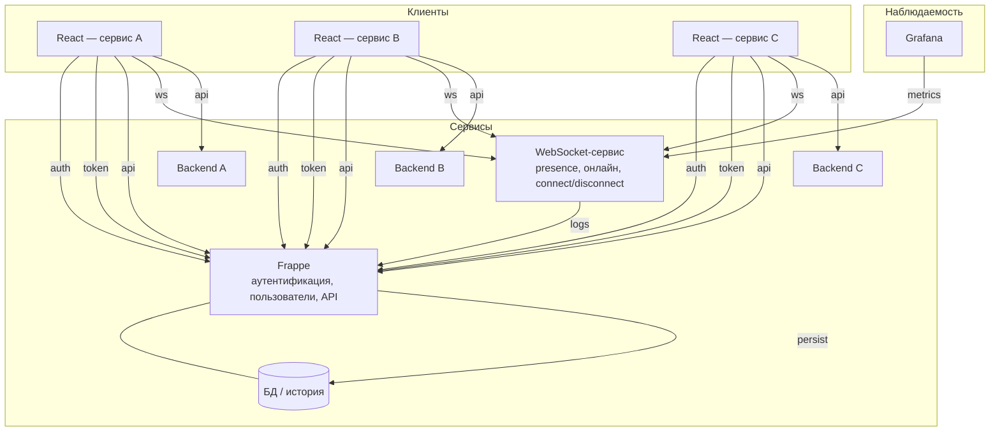
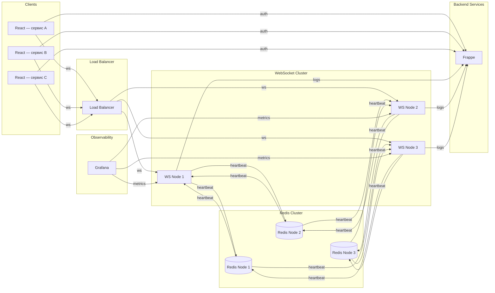
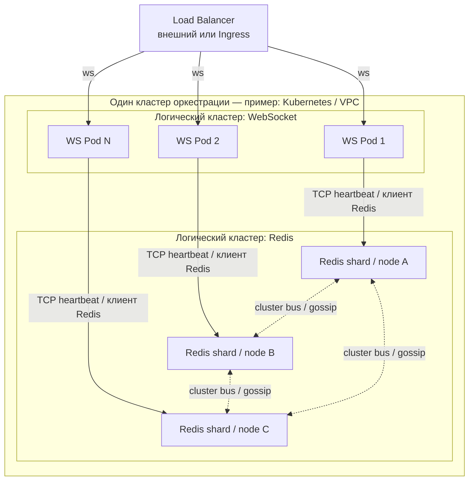
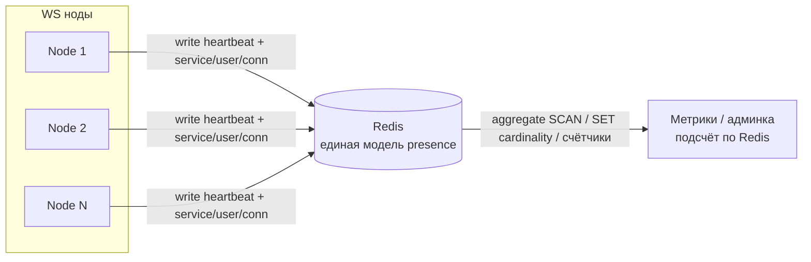

# Архитектура мультисервисной платформы

Документ описывает целевую схему платформы из независимых сервисов с общим центром идентичности и отдельным realtime-слоем. Репозиторий `frappe_pulse` (Pulse) может занимать место одного из сервисов или интегрироваться с ними по тем же принципам.

Два уровня описания:

1. **Общая картина** — все основные участники и потоки (включая backend сервисов A/B/C).
2. **Подробная схема** — масштабируемый слой **presence** на WebSocket: балансировщик, кластер **stateless** WS-нод, **Redis Cluster** как единый источник правды для активных соединений (например ZSET с временными метками и TTL/heartbeat), метрики и логирование в Frappe. Backend сервисов на детальной диаграмме не показаны — они остаются как на общей схеме (`api` к своим backend и к Frappe).

3. **Кластеризация слоёв** — ниже отдельно расписано, как масштабируется **WebSocket-уровень** и **Redis**, и в каком смысле они могут жить в «одном кластере» инфраструктуры, оставаясь **разными логическими кластерами**.

## Обзор

- Несколько продуктовых сервисов **A, B, C…**, у каждого свой backend и свой React-frontend.
- **Frappe** — центральный сервис: аутентификация, пользователи, API, хранение данных и истории.
- **WebSocket-сервис** — отдельный процесс: присутствие пользователей онлайн, учёт подключений, события connect/disconnect, метрики для наблюдаемости.
- **Grafana** — визуализация метрик, источник которых — WebSocket-сервис.

## Роли компонентов

| Компонент | Роль |
|-----------|------|
| **Frappe** | Login/session, API, идентичность пользователя, пользовательская модель, БД; приём логов входа/выхода из WebSocket-сервиса и сохранение истории. |
| **WebSocket-сервис** | Realtime presence: соединения, счётчик онлайна, события подключения/отключения; экспорт/отдача метрик; отправка сведений о login/logout в Frappe. |
| **Grafana** | Дашборды по метрикам WebSocket-сервиса. |
| **Сервисы A, B, C…** | Собственная бизнес-логика (backend) и UI (React); доверие к Frappe для auth; подключение клиентов к WebSocket-сервису для realtime. |

## Потоки данных

1. React-приложения проходят **аутентификацию** через Frappe.
2. React-приложения получают **токен** (или эквивалент сессии) от Frappe.
3. React-приложения вызывают **API Frappe** там, где нужны центральные данные и права.
4. React-приложения открывают **WebSocket** к отдельному сервису для presence и realtime.
5. React-приложения обращаются к **своему backend** по **API** сервиса.
6. WebSocket-сервис **учитывает** активные соединения и онлайн.
7. WebSocket-сервис **отдаёт метрики**; **Grafana** их **читает** (например scrape или запрос к endpoint — конкретика реализации не зафиксирована в схеме).
8. WebSocket-сервис передаёт в Frappe **логи login/logout** (или агрегаты событий); Frappe **пишет историю** в БД.

## Диаграмма: общая картина

### Условные обозначения на стрелках

- **auth** — вход, проверка учётной записи через Frappe.
- **token** — выдача токена/сессии после успешной аутентификации.
- **api** — HTTP API (к Frappe или к своему backend сервиса).
- **ws** — постоянное соединение к WebSocket-сервису для realtime presence.
- **metrics** — получение Grafana метрик с WebSocket-сервиса.
- **logs** — передача событий login/logout (или связанных записей) в Frappe.
- **persist** — сохранение истории и прочих данных в БД под управлением Frappe.

---

## Подробная схема: presence на WebSocket (масштабирование)

Ниже — уточнение только для realtime-слоя: клиенты по-прежнему проходят **auth** в Frappe, затем открывают **ws** через **Load Balancer** на одну из нод кластера. Ноды **не хранят** состояние presence локально как источник правды: они пишут и читают **heartbeat** (и связанные ключи) в **Redis Cluster**. Агрегация «кто онлайн» строится по данным Redis. Каждая WS-нода отдаёт **metrics** (endpoint для scrape или аналог); **Grafana** опрашивает ноды. События входа/выхода из presence-сессии уходят в Frappe как **logs** для истории в БД.

### Компоненты детальной схемы

| Компонент | Роль |
|-----------|------|
| **Клиенты** | Несколько React-приложений (разные сервисы); после auth к Frappe — WebSocket через балансировщик. |
| **Load Balancer** | Распределение долгоживущих WS-соединений по нодам кластера. |
| **WebSocket Cluster** | Несколько **stateless** процессов: приём/отправка событий, heartbeat в Redis, расчёт онлайна по чтению из Redis, endpoint метрик. |
| **Redis Cluster** | Общее хранилище presence (активные соединения, TTL, heartbeat); один логический источник правды для всех WS-нод. |
| **Frappe** | Аутентификация и идентичность; приём **logs** (login/logout / сессии presence) и запись истории. |
| **Grafana** | Визуализация метрик с WS-нод (в т.ч. агрегаты по онлайну, если экспортируются в метриках). |

### Потоки (детализация)

1. Клиенты → **auth** → Frappe.
2. Клиенты → **ws** → Load Balancer → конкретная WS-нода.
3. WS-ноды → **heartbeat** → Redis (запись слотов присутствия, обновление времени / TTL).
4. Redis хранит активные соединения (модель данных на стороне реализации — например ZSET по времени и политика протухания).
5. WS-ноды → **heartbeat** ← Redis (чтение для вычисления числа онлайн-пользователей и рассылки событий при необходимости).
6. WS-ноды публикуют **metrics**; Grafana забирает **metrics** с нод.
7. WS-ноды → **logs** → Frappe; Frappe сохраняет историю сессий в БД.

### Диаграмма: кластер WS + Redis

### Подписи на стрелках (детальная схема)

| Подпись | Смысл |
|---------|--------|
| **auth** | Проверка пользователя и выдача доверенных данных/токена в Frappe до установки WS. |
| **ws** | Долгоживущее WebSocket-соединение клиента (через балансировщик к ноде). |
| **heartbeat** | Запись и чтение состояния presence и служебных ключей в Redis (в т.ч. для TTL и онлайна). |
| **metrics** | Запрос метрик с WS-нод (например Prometheus scrape → Grafana). |
| **logs** | События login/logout (или эквивалент) из WS-слоя в Frappe для истории. |

---

## Один кластер или два: как не перепутать смысл слова «кластер»

**Логически это два разных кластера**, потому что это две разные подсистемы с разным масштабированием и отказами:

| | **Кластер WebSocket** | **Кластер Redis** |
|---|------------------------|-------------------|
| Что масштабируется | Процессы приложения (CPU, число одновременных соединений, event loop) | Память под ключи, пропускная способность записи/чтения, шардирование |
| Роль | Держит **открытые сокеты** у клиентов | Хранит **модель presence** (ключи, ZSET, TTL), общую для всех WS-нод |
| Отказ ноды | Соединения на этой ноде рвутся → клиент переподключается на другую (при живом LB) | Нужна политика failover / выборов мастера (зависит от топологии Redis) |

**Инфраструктурно они часто живут в одном «кластере оркестрации»** — например в одном **Kubernetes-кластере** или в одном облачном **VPC / регионе**: там разворачивают и Deployment WS-сервиса, и StatefulSet/Helm chart для Redis. Это нормально и удобно для сети (низкая задержка WS ↔ Redis) и эксплуатации. Но это **не** объединение WS и Redis в одну программную «сущность»: Redis не становится частью процесса WebSocket и наоборот.

**Вывод:** на схемах выше **WebSocket Cluster** и **Redis Cluster** — два слоя; физически они могут быть в одном K8s-кластере, логически их кластеризация описывается отдельно.

---

## Как кластеризуется WebSocket-слой

1. **Горизонтальное масштабирование** — добавляются одинаковые реплики процесса (pod/контейнер/VM). Все реплики используют один и тот же код и конфиг подключения к Redis.
2. **Load Balancer перед ними** — распределяет **новые** TCP/WebSocket-подключения. Для WS важно:
   - либо **sticky sessions** (один клиент закрепляется за одной нодой на время жизни сокета), чтобы не решать «где лежит этот socket» при каждом внутреннем событии;
   - либо **без sticky**, но тогда события между пользователями на разных нодах синхронизируются через **Redis Pub/Sub** (или аналог), чтобы «сообщить» нужной ноде отправить кадр конкретному соединению.
3. **Stateless по данным presence** — счётчики и списки онлайна не считаются «истиной» в RAM одной ноды (кроме кэша); после рестарта ноды истина восстанавливается из Redis по heartbeat/TTL.
4. **Здоровье и выкат** — readiness/liveness, **graceful shutdown**: нода перестаёт принимать новые сессии, даёт время закрыть или перенести соединения, чтобы не терять метрики и логи резко.
5. **Метрики** — каждая реплика отдаёт свой `/metrics` (или общий sidecar/агрегатор); Grafana/Prometheus обычно опрашивают **все** реплики или один сервис-дискавери по ним.

---

## Как кластеризуется Redis-слой (presence)

Redis здесь — **центральное хранилище состояния**, а не кэш «на потерю». Варианты топологии:

| Вариант | Когда уместно | Заметки для presence |
|---------|----------------|----------------------|
| **Один Redis с репликами (Sentinel или managed primary/replica)** | Умеренная нагрузка, проще операционно | Запись presence обычно идёт в **primary**; чтение для агрегаций — с primary или с политикой «читать с реплики» с учётом лага. |
| **Redis Cluster (шардирование)** | Большой объём ключей и QPS на запись | Ключи должны проектировать под **hash slots**: операции с несколькими ключами — либо в одном slot (hash tags `{}` в имени ключа), либо по одному ключу за раз, иначе `CROSSSLOT`. |
| **Управляемый Redis** (облако) | Прод без желания администрировать узлы | Те же правила: latency до WS-нод, резервирование, backup по политике продукта. |

**Данные presence** (условно: ZSET по времени последнего heartbeat, ключи с TTL, индексы по `user_id` / `room`) должны быть согласованы с правилом «кто считается офлайн» (интервал heartbeat, допущенный skew часов). WS-ноды в ideal case находятся в **той же зоне доступности**, что и Redis primary, чтобы heartbeat не страдал от межрегиональной задержки.

---

## Диаграмма: один кластер оркестрации — два логических слоя

Ниже — как **один** кластер Kubernetes (или аналог) вмещает **два независимых логических кластера**: реплики WS и узлы Redis. Стрелки **не** означают слияние приложений: только совместное размещение и сеть.

На практике клиенты Redis на WS-подах подключаются к **одному endpoint** кластера (DNS сервиса Redis); маршрутизация к нужному шарду выполняется клиентом или прокси. Диаграмма выше упрощает видимость «каждая WS-нода ходит в storage tier», не заменяя документацию Redis Cluster.

---

## Уточнение к основной диаграмме WS + Redis

На диаграмме «кластер WS + Redis» линии **heartbeat** между конкретными парами WS и Redis нарисованы **иллюстративно** (между всеми парами). В реальности при **Redis Cluster** каждая операция адресуется **ключу**, а ключ попадает на **конкретные узлы** по hash slot; при **single primary** все записи идут на один узел записи. Смысл схемы не меняется: **все WS-ноды разделяют одно хранилище presence**, топология Redis задаётся выбранным режимом кластера.

---

## Общий онлайн при разнесённых WS-нодах и принадлежность к сервису

### Почему «разброс по кластеру» не мешает общему счёту

Ноды WebSocket **не обязаны знать** полную картину по сети между собой. Каждая нода знает только **свои** открытые сокеты. Общий онлайн строится там, где состояние **сводится в одно место** — в **Redis**:

- при установке соединения нода записывает в Redis факт presence (ключ + TTL или членство в множестве + heartbeat);
- при heartbeat нода **продлевает** TTL или обновляет score во времени;
- при disconnect или протухании TTL запись **исчезает**.

Тогда **общий онлайн** — это не сумма «памяти нод», а **агрегат по данным Redis**: все ноды пишут в общий слой, любой процесс (или любая нода по запросу) может посчитать итог по правилам ниже.

### Как понять, к какому сервису относится соединение

Принадлежность к сервису **A / B / C** нужно зафиксировать **до** или **в момент** установки WebSocket и передать в Redis как часть данных:

1. Клиент после **auth** в Frappe получает токен (JWT или opaque), в котором явно есть поля вроде **`service_id` / `client_id` / `aud`** (или отдельный короткоживущий WS-токен, выданный Frappe после проверки прав на этот сервис).
2. При подключении к WS клиент передаёт этот токен; **каждая** WS-нода одинаково его проверяет и извлекает идентификатор сервиса и пользователя.
3. В Redis запись presence всегда включает измерения, например: **пользователь**, **сервис**, **уникальный connection id** (важно при нескольких вкладках).

Итог: «кто к какому сервису принадлежит» — не свойство ноды, а **поля в токене и в ключах/структурах Redis**, заполняемые при handshake.

### Модели подсчёта (практика)

| Цель | Идея |
|------|------|
| **Онлайн по сервису** | Множество (SET) или ZSET ключей вида `presence:{service}:{conn_id}` с TTL; кардинальность по паттерну или отдельный SET на сервис `online:svc:{service_id}` с `SADD`/`SREM` при connect/disconnect (и всё равно TTL на членах для самовосстановления). |
| **Общий онлайн платформы** | Либо объединённое множество всех активных `conn_id`, либо **счётчики** `INCR`/`DECR` по событиям connect/disconnect с аккуратной идемпотентностью (см. ниже). |
| **Уникальные пользователи онлайн** | Отдельно от «числа сокетов»: множество `online_users:svc:{service}` с элементами `user_id` (один пользователь — две вкладки → два conn, но один user в SET при правильном `SADD`/`SREM` по правилам продукта). |

Счётчики (`HINCRBY online_by_service ...`) дают дешёвое чтение для Grafana, но их нужно согласовать с реальностью: при обрыве без disconnect‑события корректирует **TTL + фоновая сверка**, иначе счётчик может «уплыть».

### Идемпотентность и гонки

Один пользователь может переподключиться на **другую** WS-ноду: старый ключ по `conn_id` должен протухнуть, новый создаться. Операции **connect/disconnect** для глобальных счётчиков лучше связывать с уникальным **`conn_id`**, чтобы не было двойного `-1` при дублирующих событиях (часто помогают Lua-скрипты в Redis или очередь событий с дедупликацией).

### Краткая схема потока данных для метрик

**Вывод:** общий онлайн и разрез по сервисам считаются **из Redis**, а не суммированием локальных счётчиков нод; принадлежность к сервису задаётся **явным полем после auth** и попадает в каждую запись presence.
